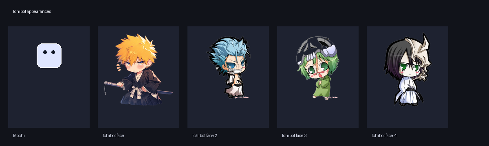

# Ichibot

Ichibot is a macOS desktop companion built with Tauri. It combines a small always-on-top mascot with a chat window, persistent conversation history, tool approvals, and selectable Claude or OpenAI models.

The desktop shell is written in Rust/Tauri, the UI in TypeScript, and the agent runs as a Node.js sidecar using the Vercel AI SDK.



## Quick start

### Requirements

- macOS for the current sidecar setup.
- Node.js 20 or newer.
- pnpm 9 or newer.
- Rust and Cargo, installed through [rustup](https://rustup.rs/).
- An Anthropic API key or OpenAI API key.

Check the tools before installing dependencies:

```bash
node --version
pnpm --version
cargo --version
```

### Install

From the repository root:

```bash
pnpm install
```

If `pnpm` is not available, install it with Corepack or your preferred package manager:

```bash
corepack enable
corepack prepare pnpm@latest --activate
```

### Configure a provider

Create a `.env` file in the repository root. It is ignored by Git.

```env
# Use one or both providers.
ANTHROPIC_API_KEY=your_anthropic_key
OPENAI_API_KEY=your_openai_key
```

The sidecar also accepts the Ichibot-specific names:

```env
ICHIBOT_CLAUDE_API_KEY=your_anthropic_key
ICHIBOT_OPENAI_API_KEY=your_openai_key
```

`ICHIBOT_*` values take precedence over the standard provider variable when both are present. Exported environment variables take precedence over values read from `.env`.

Never commit `.env` or paste a real key into source files.

Review [ASSETS.md](ASSETS.md) before redistributing the mascot images.

### Run in development

```bash
pnpm dev
```

This command:

1. Builds the Node.js agent.
2. Copies it to the Tauri sidecar location for the current macOS architecture.
3. Starts the Tauri development application.

The app opens an always-on-top mascot window and a chat window. The mascot can be dragged, clicked to open the chat, and switched between Mochi and all available face images from the **Apariencia** submenu in the tray menu. The last selected appearance is remembered by the overlay. Face images are preprocessed into transparent PNGs under `apps/tauri/public/avatars/`.

The chat also includes a **Caras** picker with visual thumbnails for changing the mascot appearance without opening the tray menu.

## Using the app

### Select a provider and model

Use the provider and model selectors in the chat header. Current choices include Claude models and OpenAI models such as GPT-4o mini, GPT-5 mini, and GPT-5. Ichibot remembers the last selected provider and model locally.

The selected provider must have a valid API key. A ChatGPT or Claude web subscription is not automatically an API key for this integration.

### Enter keys from the app

The **Claves** button opens a local configuration dialog where you can enter Anthropic and OpenAI keys without exporting them in the shell.

The current implementation stores the keys in the macOS Keychain under the `com.ichibot.app` service. The chat only keeps them in memory while the app is running.

The same dialog includes **Borrar claves**, which removes both provider keys from the Keychain after confirmation.

### Conversation history

Conversations are stored in:

```text
~/.ichibot/sessions.json
```

The chat sidebar supports creating, opening, and deleting conversations. The agent creates a new active conversation on startup while retaining previous sessions in the history.

### Tool approvals

When the agent requests an action that requires permission, Ichibot opens an approval dialog with options to allow, deny, or always allow that type of action.

The current tools include `read_file`, `get_current_datetime`, and `run_shell`. The date/time tool uses the Europe/Madrid timezone by default so questions about the current day do not rely on model memory. `run_shell` only runs after explicit approval, uses the project directory, limits execution to 10 seconds and 20,000 characters, removes sensitive environment variables, and blocks common destructive commands. It is a safety layer, not a full operating-system sandbox.

Long responses can be stopped with **Parar**. Failed requests expose a **Reintentar** action.

### Claude Code login

The tray menu includes a Claude Code login action that runs:

```bash
claude auth login
```

This starts the official Claude Code login flow. The current Vercel AI SDK provider path still uses an API key; Claude Code subscription authentication is not yet used as the agent transport.

## Project structure

```text
apps/
  agent/                 Node.js sidecar and provider integration
    src/index.ts         JSONL stdin/stdout entry point
    src/agent.ts         Streaming chat, sessions, models, and tools
    src/store.ts         Persistent session storage
    src/env.ts           Minimal .env loader
  tauri/                 Tauri desktop application
    src/main.ts          Chat window
    src/overlay.ts       Mascot window and sidecar owner
    src/agent-bridge.ts  JSONL bridge to the sidecar
    src/mochi.ts         Mascot rendering and appearance switching
    src-tauri/            Rust tray, windows, commands, and packaging
packages/
  shared/                Shared TypeScript event and session types
```

There is one sidecar owner: the overlay window starts the agent and relays events to the chat window through Tauri events. This avoids creating independent agent processes for the mascot and chat.

## Useful commands

From the repository root:

```bash
# Build the agent only
pnpm build:agent

# Copy the agent into the Tauri sidecar location
pnpm sidecar

# Start only the Tauri application
pnpm dev:tauri

# Start the agent in watch mode
pnpm dev:agent

# Build the application
pnpm build

# Run the agent tests
pnpm test

# Build an unsigned macOS DMG locally
pnpm bundle:mac
```

The DMG is generated under `apps/tauri/src-tauri/target/release/bundle/dmg/`. The local bundle is unsigned, so macOS may require a manual approval in **System Settings → Privacy & Security** on first launch.

## GitHub and releases

The repository includes `.github/workflows/build-macos.yml`. It builds separate unsigned DMGs for Apple Silicon and Intel when run manually or when a `v*` tag is pushed. Manual runs upload workflow artifacts; tag pushes additionally publish both DMGs in a GitHub Release with generated release notes.

To publish a version after adding a GitHub remote:

```bash
git add .
git commit -m "chore: prepare Ichibot macOS packaging"
git push -u origin main
git tag v0.1.0
git push origin v0.1.0
```

Pushing the tag starts both architecture builds and publishes the release automatically. The workflow needs the repository's default `GITHUB_TOKEN` with contents write permission, which is configured in the workflow.

For a polished public release, add Apple Developer signing and notarisation secrets before distributing the DMGs broadly. The current workflow intentionally produces unsigned development installers.

Automatic updates are not enabled yet. Enabling them requires a Tauri updater signing key, a public key in the application configuration, and a release endpoint that serves signed update manifests and installers. These values should be supplied as project-owned secrets/configuration before enabling updater code.

Focused checks used during development:

```bash
cd apps/agent
./node_modules/.bin/tsc --noEmit -p tsconfig.json

cd ../tauri
./node_modules/.bin/tsc -p tsconfig.json --noEmit
./node_modules/.bin/vite build

cd src-tauri
cargo check
```

## Troubleshooting

### The agent does not start

- Run `pnpm build:agent && pnpm sidecar` before starting Tauri.
- Make sure the generated file exists at `apps/tauri/src-tauri/binaries/agent-aarch64-apple-darwin` on Apple Silicon or the matching Intel filename.
- Confirm that the sidecar file is executable.
- Start the app with `pnpm dev` from the repository root.

### The provider returns an error

The chat displays a friendly Spanish explanation followed by the provider detail. Common causes are:

- Missing or invalid API key.
- Provider quota or rate limit reached.
- The selected model is unavailable for the account.
- Network connectivity problems.

Try `GPT-4o mini` for a conservative OpenAI baseline, then switch models after the connection works.

### The chat opens but does not stream text

- Restart the app after changing the sidecar or UI build.
- Save the key again from **Claves**.
- Check the error shown in the assistant bubble.
- Verify that the selected provider matches the key you entered.

### The app opens in a normal browser

The sidecar requires Tauri. Open the window created by `pnpm dev`; do not use the Vite URL as a normal browser page.

## Current limitations

- The bundled sidecar setup currently targets macOS development architectures.
- Provider authentication uses API keys in the agent path.
- Claude Code and ChatGPT subscriptions are not automatically reused by the Vercel AI SDK provider clients.
- Shell commands can run after approval, with conservative time/output limits and a destructive-command blocklist; this is not a full OS sandbox.
- Automated coverage currently focuses on the agent session store; UI and provider integrations still need broader tests.

## Security notes

- Keep `.env` private and rotate any key that has been exposed.
- Do not commit generated sidecars or API keys.
- API keys are stored in the macOS Keychain, but still avoid exposing them in logs or screenshots.
- Review tool approval prompts before allowing actions.
